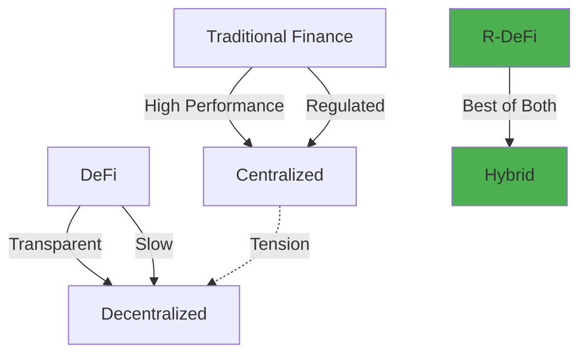
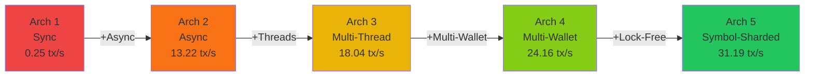
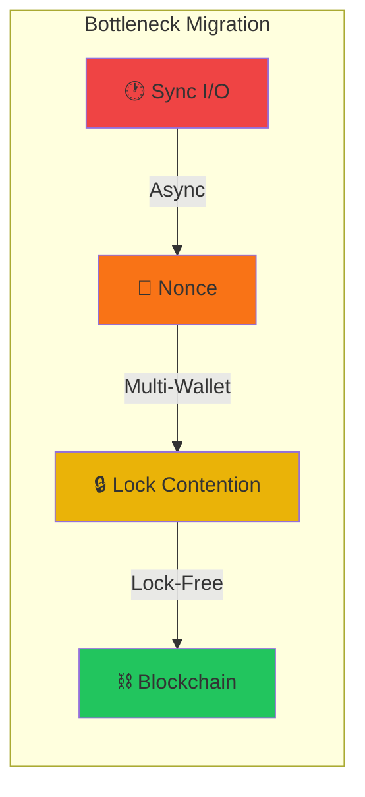

# Architectural Patterns for High-Throughput Blockchain-Based Trading

<div class="text-xl text-gray-300 mt-2">
An Empirical Study from Production
</div>

<div class="mt-6 text-base text-gray-400">
  <strong>Dr. Andrew Le Gear</strong><sup>1</sup>, <strong>Tawny Whatmore</strong><sup>2</sup>, <strong>Dr. Ashish Sai</strong><sup>3</sup>
</div>

<div class="mt-2 text-sm text-gray-500">
  <sup>1</sup>Bernal Institute, University of Limerick &nbsp;|&nbsp; <sup>2</sup>Horizon Globex Ireland &nbsp;|&nbsp; <sup>3</sup>Maastricht University
</div>

<div class="pt-6">
  <span class="text-base opacity-80">
    BlockArch26 @ ICSA 2026
  </span>
</div>

<div class="abs-br m-6 flex gap-4 items-center">
  
  
  
  
</div>

---
transition: fade-out
layout: two-cols
---

# The R-DeFi Challenge

<v-clicks>

### The Tension

- **DeFi** promises transparency & immutability <sup>&#91;1&#93;</sup>
- **Regulations** demand KYC/AML compliance <sup>&#91;2&#93;</sup>
- These requirements seem incompatible

### The Performance Gap

- Ethereum: **15-30 TPS** on base layer <sup>&#91;3&#93;</sup>
- Traditional finance: **orders of magnitude higher**
- Gas costs make on-chain compliance non-viable <sup>&#91;4&#93;</sup>

### The Dilemma

> Full decentralization → Non-compliance  
> Full centralization → Lose blockchain benefits

</v-clicks>

::right::

<div class="pl-8 pt-12">



<div class="mt-8 p-4 bg-green-900/30 rounded">
  <strong>Our Solution:</strong> Two-Layer Hybrid Architecture
</div>

</div>

---
layout: center
class: text-center
---

# Research Questions

<div class="grid grid-cols-1 gap-4 mt-4 max-w-4xl mx-auto">

<v-click>
<div class="p-4 bg-blue-900/40 rounded-lg text-left">
  <div class="text-blue-400 font-bold mb-1">RQ1: Throughput Ceiling</div>
  <div class="text-gray-300 text-sm">What throughput ceiling does this architecture face given gas-based block limits and regulatory constraints?</div>
</div>
</v-click>

<v-click>
<div class="p-4 bg-purple-900/40 rounded-lg text-left">
  <div class="text-purple-400 font-bold mb-1">RQ2: HFT Pattern Adaptation</div>
  <div class="text-gray-300 text-sm">How can lock-free concurrency patterns from HFT <sup>&#91;7&#93;</sup> be adapted to blockchain's nonce constraints?</div>
</div>
</v-click>

<v-click>
<div class="p-4 bg-green-900/40 rounded-lg text-left">
  <div class="text-green-400 font-bold mb-1">RQ3: Architecture vs. Latency</div>
  <div class="text-gray-300 text-sm">What is the relationship between architectural design choices and settlement latency?</div>
</div>
</v-click>

</div>

---
layout: two-cols
---

# Two-Layer Architecture

<v-clicks>

## Layer 1: Off-Chain Server
- User authentication & order matching
- **KYC/AML compliance checks** <sup>&#91;2&#93;</sup>
- Live order book management

## Layer 2: On-Chain Settlement
- IBFT 2.0 consensus (4s block time) <sup>&#91;5&#93;</sup>
- `ATS.sol` smart contract
- Immutable settlement records

</v-clicks>

<v-click>

<div class="mt-4 p-3 bg-amber-900/30 rounded border-l-4 border-amber-500 text-sm">
  <strong>Key:</strong> Horizon Globex trading platform
</div>

</v-click>

::right::

<div class="pl-4 flex items-center h-full">
  
</div>

---
layout: center
---

# The Ablation Study

<div class="text-center text-gray-400 mb-4">5 Architectures, Progressive Optimization</div>

<div class="flex gap-4 items-center justify-center">

<div>



</div>

</div>

<v-click>

<div class="mt-6 grid grid-cols-2 gap-4 text-center max-w-md mx-auto">
  <div class="p-3 bg-red-900/30 rounded">
    <div class="text-2xl font-bold text-red-400">125×</div>
    <div class="text-sm">Full Ablation Gain</div>
  </div>
  <div class="p-3 bg-green-900/30 rounded">
    <div class="text-2xl font-bold text-green-400">1.74×</div>
    <div class="text-sm">Burst Handling Capacity</div>
  </div>
</div>

</v-click>

---
layout: two-cols
---

# Symbol-Sharded Model

<v-clicks>

### Complete Isolation
- **Dedicated wallet** per symbol
- **Dedicated contract** per symbol  
- **Dedicated HttpClient** per symbol
- **Zero cross-symbol contention**

### Lock-Free Queuing
- ConcurrentQueue implementation <sup>&#91;6&#93;</sup>
- Michael-Scott algorithm (CAS) <sup>&#91;7&#93;</sup>
- No locks, no semaphores

### Result
- **31.19 tx/sec** burst throughput
- **44% latency** reduction
- **1.74×** sustained blockchain capacity

</v-clicks>

::right::

<div class="pl-4 flex items-center h-full">
  
</div>

---

# Architecture 1 → 2: Async Transformation

The most dramatic improvement: **52× throughput gain**

````md magic-move {lines: true}
```csharp {*|4-7|9-11|*}
// Architecture 1: Sequential Blocking (0.25 tx/sec)
// From: SequentialBlockingSingleThreaded/Program.cs

for (int i = 0; i < TOTAL_TRANSACTIONS; i++)
{
    string symbol = symbols[random.Next(symbols.Length)];
    var receipt = await SubmitTradeAsync(web3, atsContractAddress, symbol);
    
    // BLOCKING: Waits for transaction to be mined!
    // ~4 seconds per transaction = 0.25 tx/sec
}
```

```csharp {*|2-3|5-12|14-19|*}
// Architecture 2: Async with Background Mining (13.22 tx/sec)
// From: SequentialAsyncSingleWallet/Program.cs
var pendingTxs = new BlockingCollection<string>();

// Producer: Submit transactions rapidly
Task.Run(async () => {
    for (int i = 0; i < TOTAL_TRANSACTIONS; i++) {
        string symbol = symbols[random.Next(symbols.Length)];
        var txHash = await SubmitTradeWithoutWaiting(web3, atsAddress, symbol);
        pendingTxs.Add(txHash);  // Don't wait for mining!
    }
});

// Consumer: Poll for confirmations in background
Task.Run(async () => {
    foreach (var txHash in pendingTxs.GetConsumingEnumerable()) {
        await WaitForConfirmation(web3, txHash);
    }
});
```
````

<v-click>

<div class="mt-4 p-4 bg-blue-900/30 rounded">
  <strong>💡 Result:</strong> Decoupling submission from confirmation yields 52× improvement
</div>

</v-click>

---

# Architecture 2 → 3: The Nonce Wall

Adding threads yields only **36% gain** — why?

````md magic-move {lines: true}
```csharp {*|4-6|*}
// Architecture 3: Multi-threaded, Single Wallet
public async Task SubmitTradesParallel(Trade[] trades) {
    var tasks = trades.Select(t => SubmitTradeAsync(t));
    await Task.WhenAll(tasks);  // All threads use SAME wallet
}

// Expected: Linear scaling with thread count
// Reality: Only 36% improvement (13.22 → 18.04 tx/sec)
```

```csharp {*|2-5|7-10|*}
// The Problem: Ethereum's Nonce Mechanism
// Each wallet has a sequential transaction counter:
//   Tx #1: nonce = 0
//   Tx #2: nonce = 1  (must wait for #1)
//   Tx #3: nonce = 2  (must wait for #2)

// Multiple threads competing for the SAME nonce:
// Thread A: nonce 5 ✓
// Thread B: nonce 5 ✗ REJECTED (duplicate)
// Thread C: nonce 7 ✗ REJECTED (gap - nonce 6 missing)
```
````

<v-click>

<div class="mt-4 p-4 bg-yellow-900/30 rounded border-l-4 border-yellow-500">
  <strong>⚠️ Amdahl's Law <sup>&#91;8&#93;</sup> in Action:</strong> The nonce is a sequential bottleneck — no amount of parallelism helps!
</div>

</v-click>

---

# Architecture 3 → 4: The Server-Side Crisis

Throughput up, but **latency explodes 9×**

````md magic-move {lines: true}
```csharp {*|2-4|6-9|*}
// Architecture 4: Multi-Wallet Strategy
// Solution: Give each symbol its own wallet!
var wallets = new Dictionary<string, Wallet> {
    ["AAPL"] = new Wallet("0x..."),
    ["GOOGL"] = new Wallet("0x..."),
    // ... independent nonce sequences!
};

// Throughput improves: 18.04 → 24.16 tx/sec ✓
```

```csharp {*|3-8|10-14|*}
// But disaster strikes...
public async Task SubmitTrade(Trade trade) {
    // All threads fight for shared resources!
    lock (sharedQueue) {           // CONTENTION
        sharedQueue.Enqueue(trade);
    }
    lock (connectionPool) {        // MORE CONTENTION  
        var conn = connectionPool.Get();
    }
}

// Latency EXPLODES:
//   Before: 2.96 seconds average
//   After:  27.21 seconds average  (9× WORSE!)
//   P99:    28.97 seconds
```
````

<v-click>

<div class="mt-4 p-4 bg-red-900/40 rounded border-l-4 border-red-500">
  <strong>🔥 Critical Discovery:</strong> Removing blockchain bottleneck exposed a <em>hidden server-side crisis</em>
</div>

</v-click>

---

# Architecture 5: Symbol-Sharded Lock-Free

The solution: **Partition everything by symbol**

````md magic-move {lines: true}
```csharp {*|2-4|*}
// The Problem: Shared resources cause contention
var sharedQueue = new Queue<Trade>();      // Single point of contention
var sharedPool = new ConnectionPool();     // Lock convoying
var sharedState = new TradingState();      // Cache thrashing
```

```csharp {*|2-8|10-16|*}
// Architecture 5: Symbol-Sharded Lock-Free
// From: SymbolShardedLockFreeMultiWallet/Program.cs

// Each symbol gets dedicated resources:
var symbolMappings = new Dictionary<string, (string contractAddress, string walletAddress)>
{
    { "AAPL", ("0xf556...7212", "0x0795...8896") },
    { "AMD",  ("0x9ecd...e28a", "0x6bcc...ab42") },
    { "AMZN", ("0x4f5b...02f9", "0xde3f...0e4f") },
    // ... 10 symbols, each with own contract + wallet
};

// DEDICATED HttpClient per symbol - no connection pool contention!
var symbolHttpClients = new Dictionary<string, HttpClient>();
foreach (var symbol in symbolMappings.Keys) {
    symbolHttpClients[symbol] = new HttpClient();  // Isolated!
}
```

```csharp {*|2-5|7-12|*}
// Lock-free queue using ConcurrentQueue&lt;T&gt; [6]
// NO artificial delays, NO semaphores, NO locks - pure parallelism!
var transactionQueue = new BlockingCollection<string>(
    new ConcurrentQueue<string>()  // Michael-Scott algorithm [7]
);

// Process all symbols in parallel with zero contention:
var tasks = symbolMappings.Select(async mapping => {
    var (symbol, (contractAddr, walletAddr)) = mapping;
    var web3 = new Web3(account, symbolHttpClients[symbol]);  // Nethereum [9]
    await ProcessSymbolTransactions(web3, symbol, contractAddr);
}).ToArray();
await Task.WhenAll(tasks);
```
````

---
layout: two-cols
---

# Results Summary

| Arch | Throughput | Latency | Tx/Block |
|------|-----------|---------|----------|
| 1 | 0.25 tx/s | 4.00s | 1.0 |
| 2 | 13.22 tx/s | 2.92s | 52.6 |
| 3 | 18.04 tx/s | 2.96s | 71.4 |
| 4 | 24.16 tx/s | **27.21s** | 111.1 |
| **5** | **31.19 tx/s** | 15.43s | **125.0** |

<v-click>

<div class="mt-2 text-sm">

**Key Findings:**
- 1.74× burst over sustained capacity
- 2.8× over conventional async
- 44% latency reduction

</div>

</v-click>

::right::

<div class="pl-4 pt-4">
  
  
</div>

---
layout: center
---

# Sustained vs. Burst Throughput

<div class="text-center text-gray-400 mb-4">Understanding the gas-based theoretical limit</div>

<div class="grid grid-cols-2 gap-8 max-w-4xl mx-auto">

<div class="p-4 bg-slate-800 rounded-lg">

### Sustained Capacity (Gas-Based)

$$\lambda_{sustained} = \frac{G_{block}}{G_{tx} \times T_{block}}$$

<v-click>

For our IBFT 2.0 network <sup>&#91;5&#93;</sup>:

$$= \frac{10,485,760}{146,194 \times 4\text{s}} \approx 17.93 \text{ tx/sec}$$

(~71.7 tx per 4-second block)

</v-click>

</div>

<div class="p-4 bg-slate-800 rounded-lg">

### Burst Handling Result

<v-click>

| Metric | Value |
|--------|-------|
| Sustained Capacity | ~17.93 tx/sec |
| **Observed Burst** | **31.19 tx/sec** |
| **Burst Ratio** | **1.74×** |

</v-click>

<v-click>

<div class="mt-4 p-3 bg-green-900/30 rounded text-sm">
<strong>✓ Burst handling demonstrated</strong><br/>
Architecture handles bursty trading workloads!
</div>

</v-click>

</div>

</div>

<v-click>

<div class="mt-4 text-center text-gray-400 text-sm">
With gas limit of 125 tx/block and 4-second blocks, no software optimization can exceed 31.25 tx/sec
</div>

</v-click>

---
layout: center
---

# The Migrating Bottleneck Phenomenon

<div class="text-center text-gray-400 mb-2 text-sm">Each optimization exposed a new constraint</div>



<v-clicks>

<div class="mt-2 grid grid-cols-3 gap-2 text-xs">
  <div class="p-2 bg-slate-800 rounded text-center">
    <div class="text-base mb-1">🎯</div>
    <div class="font-bold text-sm">C5: Server Crisis</div>
    <div class="text-gray-400">First documented</div>
  </div>
  <div class="p-2 bg-slate-800 rounded text-center">
    <div class="text-base mb-1">⚖️</div>
    <div class="font-bold text-sm">Holistic Co-Design</div>
    <div class="text-gray-400">On + off-chain</div>
  </div>
  <div class="p-2 bg-slate-800 rounded text-center">
    <div class="text-base mb-1">📈</div>
    <div class="font-bold text-sm">Linear Scaling</div>
    <div class="text-gray-400">With blockchain</div>
  </div>
</div>

</v-clicks>

---
layout: center
---

# Complete Solution Architecture

<div class="flex justify-center">
  
</div>

<div class="mt-2 text-center text-gray-400 text-sm">
Architecture 5: Symbol-sharded lock-free design with dedicated resources per trading symbol
</div>

---

# Answering the Research Questions

<div class="grid grid-cols-1 gap-4 mt-2">

<v-click>
<div class="p-4 bg-blue-900/30 rounded-lg">
  <div class="text-blue-400 font-bold mb-1">RQ1: Throughput Ceiling</div>
  <div class="text-xl font-bold text-white">31.19 tx/sec = 1.74× burst over sustained capacity</div>
  <div class="text-gray-400 text-sm">Bottlenecks shift: Sync I/O → Nonce → Lock Contention → Blockchain</div>
</div>
</v-click>

<v-click>
<div class="p-4 bg-purple-900/30 rounded-lg">
  <div class="text-purple-400 font-bold mb-1">RQ2: HFT Pattern Adaptation</div>
  <div class="text-xl font-bold text-white">Symbol-sharded ConcurrentQueue works!</div>
  <div class="text-gray-400 text-sm">Requires co-design with nonce management; P99 latency remains a challenge</div>
</div>
</v-click>

<v-click>
<div class="p-4 bg-green-900/30 rounded-lg">
  <div class="text-green-400 font-bold mb-1">RQ3: Architecture vs. Latency</div>
  <div class="text-xl font-bold text-white">9× latency explosion → then 44% reduction</div>
  <div class="text-gray-400 text-sm">Architecture choices are critical for both throughput and latency</div>
</div>
</v-click>

</div>

---
layout: two-cols
---

# Latency Deep-Dive

The critical P99 story

<v-clicks>

### Architecture 4 Crisis
- Average: **27.21 seconds**
- P99: **28.97 seconds**
- Lock contention devastating!

### Architecture 5 Recovery
- Average: **15.43 seconds** (44% ↓)
- P99: **30.14 seconds**
- High P99 due to queue depth

### Key Insight
Lock-free improves averages but queue depth at saturation affects tail latency

</v-clicks>

::right::

<div class="pl-4 flex items-center h-full">
  
</div>

---
layout: two-cols
---

# Key Contributions

<v-clicks>

1. **Production-Deployed Architecture**  
   Empirical study of live R-DeFi system <sup>&#91;2&#93;</sup>

2. **Ablation Methodology**  
   Systematic bottleneck isolation

3. **Symbol-Sharded Lock-Free Model** <sup>&#91;7&#93;</sup>  
   1.74× burst capacity, 2.8× improvement

4. **Nonce Contention Quantified**  
   36% limit validates Amdahl's Law <sup>&#91;8&#93;</sup>

5. **Server-Side Crisis Documented**  
   First evidence of migrating bottlenecks

</v-clicks>

::right::

<div class="pl-8 pt-8">

<v-click>

## Future Work

- **MEV Mitigation**  
  Fair ordering protocols

- **Cross-Shard Atomicity**  
  Multi-symbol atomic swaps

- **Platform Generalization**  
  Hyperledger Fabric testing

- **Dynamic Scaling**  
  Adaptive shard allocation

</v-click>

<v-click>

<div class="mt-8 p-4 bg-slate-700 rounded">
  <div class="text-sm font-bold mb-2">📦 Open Source</div>
  <code class="text-xs">github.com/HorizonFintex/blockchain-trading-architectures</code>
</div>

</v-click>

</div>

---
layout: center
class: text-center
---

# Thank You

<div class="text-2xl text-gray-300 mt-4 mb-8">
  Questions?
</div>

<div class="grid grid-cols-4 gap-8 items-center justify-center max-w-3xl mx-auto">
  
  
  
  
</div>

<div class="mt-12 text-gray-400">
  <div class="mb-2">📧 andrew.legear@horizon-globex.ie | andrew.p.legear@ul.ie</div>
  <div>🔗 <code>github.com/HorizonFintex/blockchain-trading-architectures</code></div>
</div>

<div class="abs-bl m-6 text-xs text-gray-500">
  BlockArch26 @ ICSA 2026 | Architectural Patterns for High-Throughput Blockchain-Based Trading
</div>

---
layout: end
---

# Appendix: Performance Data

<div class="text-sm">

| Architecture | Key Feature | Throughput | Total Time | Avg Latency | P99 Latency | Tx/Block |
|-------------|-------------|-----------|------------|-------------|-------------|----------|
| 1 | Sync, Single-Wallet | 0.25 tx/s | 3999.79s | 4.000s | 4.206s | 1.00 |
| 2 | Async, Single-Wallet | 13.22 tx/s | 75.67s | 2.916s | 4.913s | 52.63 |
| 3 | Multi-Thread, Async | 18.04 tx/s | 55.42s | 2.959s | 5.177s | 71.43 |
| 4 | Unsync Multi-Wallet | 24.16 tx/s | 41.39s | 27.211s | 28.972s | 111.11 |
| **5** | **Symbol-Sharded** | **31.19 tx/s** | **32.06s** | 15.432s | 30.136s | **125.00** |

</div>

<div class="mt-8 text-gray-400 text-sm">
  Test Configuration: 1,000 transactions across 10 symbols (AAPL, AMD, AMZN, GOOGL, INTC, META, MSFT, NFLX, NVDA, TSLA)  
  Network: Private IBFT 2.0 <sup>&#91;5&#93;</sup>, 4-second block time  
  Hardware: Intel i7-13700H, 64GB RAM
</div>

---
layout: center
---

# References

<div class="text-sm grid grid-cols-1 gap-1 max-w-4xl mx-auto">

<div class="p-2 bg-slate-800/50 rounded">
<strong>[1]</strong> Buterin, V. "A next-generation smart contract and decentralized application platform." <em>Ethereum White Paper</em>, 2014.
</div>

<div class="p-2 bg-slate-800/50 rounded">
<strong>[2]</strong> FATF. "Updated Guidance for a Risk-Based Approach to Virtual Assets and VASPs." <em>Financial Action Task Force</em>, 2021.
</div>

<div class="p-2 bg-slate-800/50 rounded">
<strong>[3]</strong> Croman, K. et al. "On Scaling Decentralized Blockchains." <em>FC 2016 Workshops, BITCOIN</em>, pp. 106-125.
</div>

<div class="p-2 bg-slate-800/50 rounded">
<strong>[4]</strong> Pierro, G.A. & Rocha, H. "The Influence of Ethereum Gas Price on Transaction Throughput." <em>IEEE Blockchain</em>, 2019.
</div>

<div class="p-2 bg-slate-800/50 rounded">
<strong>[5]</strong> Saltini, R. & Hyland-Wood, D. "IBFT 2.0: A Byzantine Fault Tolerant Consensus." <em>arXiv:1909.10194</em>, 2019.
</div>

<div class="p-2 bg-slate-800/50 rounded">
<strong>[6]</strong> Microsoft. "ConcurrentQueue Class." <em>.NET Documentation</em>, 2024.
</div>

<div class="p-2 bg-slate-800/50 rounded">
<strong>[7]</strong> Michael, M.M. & Scott, M.L. "Simple, Fast, and Practical Non-Blocking Concurrent Queue Algorithms." <em>PODC '96</em>, pp. 267-275.
</div>

<div class="p-2 bg-slate-800/50 rounded">
<strong>[8]</strong> Amdahl, G.M. "Validity of the single processor approach to achieving large scale computing capabilities." <em>AFIPS '67</em>, pp. 483-485.
</div>

<div class="p-2 bg-slate-800/50 rounded">
<strong>[9]</strong> Nethereum Contributors. "Nethereum: .NET Integration Library for Ethereum." <em>GitHub</em>, 2024.
</div>

</div>
